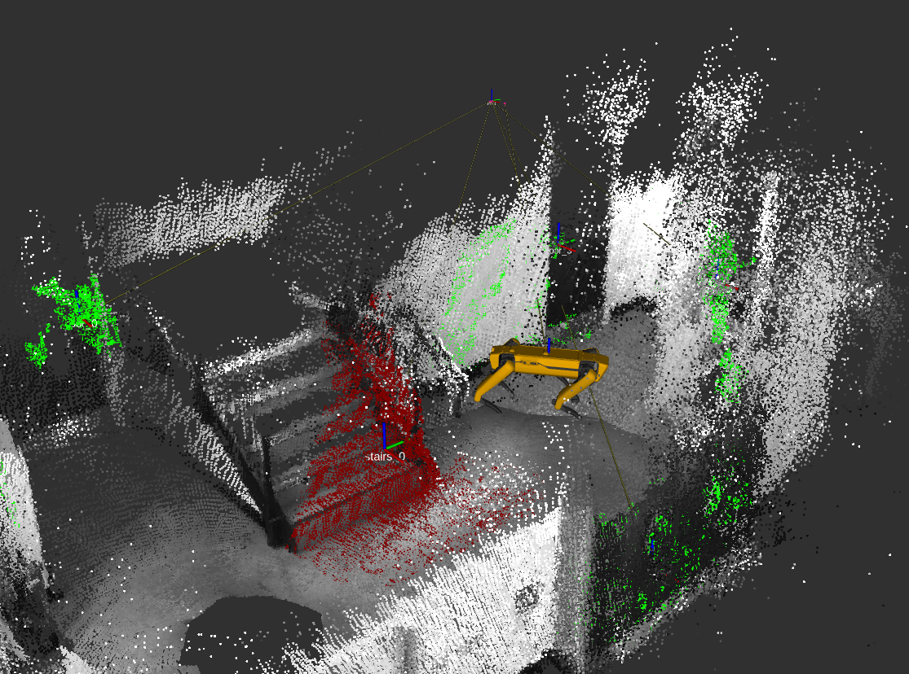
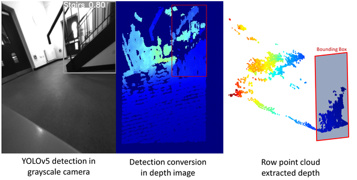

# RGB-D-Map-Segmentation-and-Pose-Estimation
Map point cloud segmentation using RGB-D sensor. 
The mapping is using [`rtabmap`](https://github.com/introlab/rtabmap_ros) and do the segmentation at the same time.
This project work using [`yolov5`](https://github.com/ultralytics/yolov5) as an object detector, using filtering to update extracted point cloud in the map frame and estimate the position from the object to the map.
The code was designed to work out of the box with the Spot Robot body camera.

- Tested under Ubuntu 18.04 and ROS Melodic
- Require [![python-second-image]][python3-url] and [![python-image]][python3-url]



## Getting Started

### 1.1. Setup the workspace

clone the repository to your ros workspace

```shell script
cd ~/ros_ws/src/
git clone https://github.com/sugnite/RGB-D-Map-Segmentation-and-Pose-Estimation
```
Install the requirements for [![python-image]][python3-url]
It's recommanded to create a virtual environement for both python versions
(rgbd_sem_py3 and rgbd_sem_py2 in this case)

```shell script
(rgbd_sem_py3)$ pip3 install -U -r requirements3.txt
```
Install requirements for [![python-second-image]][python3-url]

```shell script
(rgbd_sem_py2)$ pip install -U -r requirements.txt
```
### 1.2. Setup Yolov5
Download the [`yolov5`](https://github.com/sugnite/yolov5_ros) for ROS package in your workspace directory.
Follow the [instructions](https://github.com/sugnite/yolov5_ros) to setup the package.

```shell script
git clone https://github.com/sugnite/yolov5_ros
```

Download the weight of the project (require [`gdown`](https://github.com/wkentaro/gdown)).

```shell script
pip install down
cd ~/ros_ws/src/yolov5_ros/src/yolov5
gdown https://drive.google.com/uc?id=1YIUekSGq6SvQ7KzKNgbcB-D4Yt8-SDLP
```
### 1.3. Setup RTAB-Map

Install rtab-map package for the mapping process

```shell script
sudo apt install ros-melodic-rtabmap-ros
```
### 1.4. Install Spot Package

Install Spot packages from [clearpath robotics](https://github.com/clearpathrobotics/spot_ros)

```shell script
(rgbd_sem_py3)$ pip3 install bosdyn-client bosdyn-mission bosdyn-api bosdyn-core
git clone https://github.com/clearpathrobotics/spot_ros
```
### 1.5. Make your workspace

Make your workspace executable

```shell script
cd ~/ros_ws/
catkin_make
source devel/setup.bash
```
### 1.6. Download the rosbag for tests (optional)

Download the testing rosbag 

```shell script
cd ~/ros_ws/src/RGB-D-Map-Segmentation-and-Pose-Estimation/rgbd_map_segmentation_and_pose_estimation/bags
gdown https://drive.google.com/uc?id=1tAV1GYfxH25EosJLpR4FSFkXNUuFxjuB
```


## Run the program

The program work with 2 files to start in both python2 an python3

### 2.1. Run the Demo bag

Setup sim parameters

First Terminal
```shell script
roscore
```
Second Terminal
```shell script
rosparam set use_sim_time true
roscd rgbd_map_segmentation_and_pose_estimation/bags 
rosbag play --clock spot_demo_bag.bag
```
The next launch file will start the object detection network and the 3D filtering of the extracted point cloud



Third Terminal | [![python-image]][python3-url]
```shell script
(rgbd_sem_py3)$ roslaunch rgbd_map_segmentation_and_pose_estimation semantic_classifier.launch
```

The last file will start the point cloud extraction and 3D pose estimation of the segmented objects

Fourth Terminal | [![python-second-image]][python3-url]
```shell script
(rgbd_sem_py2)$ roslaunch rgbd_map_segmentation_and_pose_estimation second_node_semantic_classifier.launch
```
[python-image]: https://img.shields.io/badge/Python-3.8-blue.svg
[python3-url]: https://www.python.org/
[python-second-image]: https://img.shields.io/badge/Python-2.7-green.svg